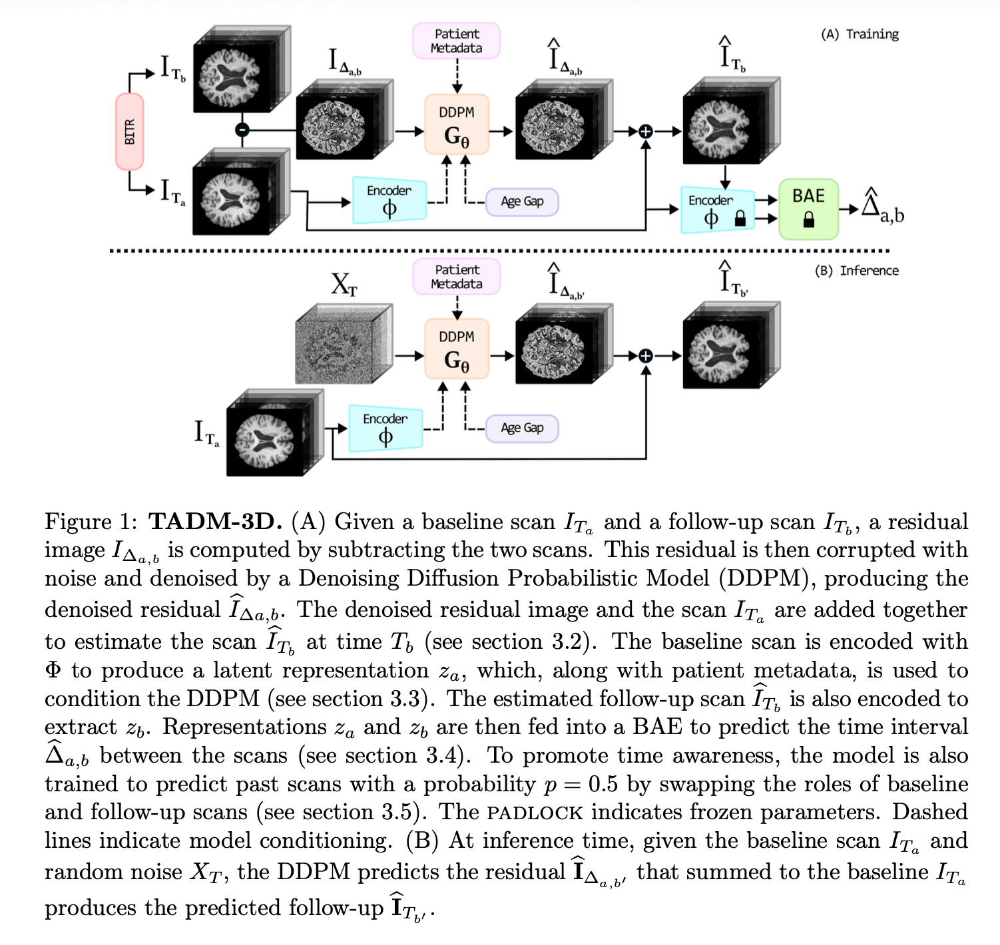
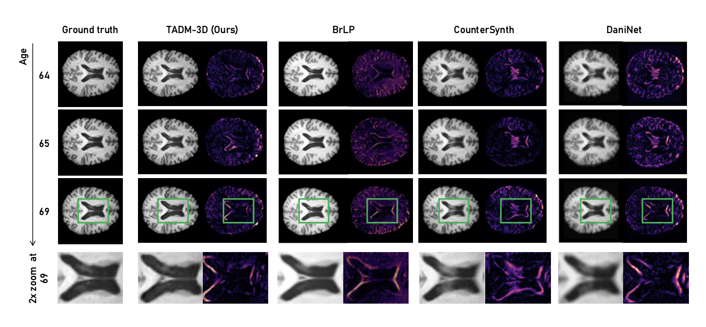
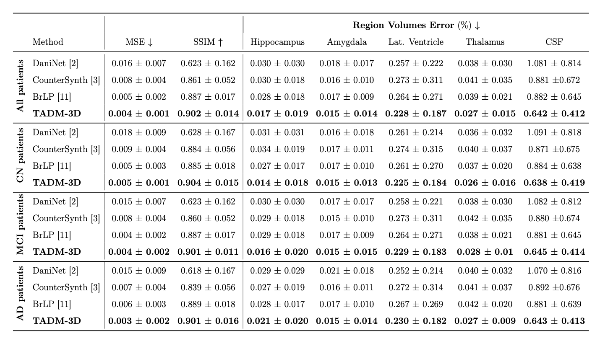

# TADM-3D  
**Temporally-Aware Diffusion Model for 3D Brain Progression Modelling**

[](https://www.sciencedirect.com/science/article/pii/S0895611125001971)
[](#usage)
[](#license)

This repository will host the official implementation of **TADM-3D**, introduced in:

> **Temporally-Aware Diffusion Model for Brain Progression Modelling with Bidirectional Temporal Regularisation**  
> *Computerized Medical Imaging and Graphics (CMIG), 2025*

---

## 🧠 Overview

TADM-3D is a **3D diffusion-based framework** for predicting longitudinal brain MRI progression.  
The model learns to forecast future brain anatomy by explicitly modelling the relationship between **structural changes and time intervals**, enabling patient-specific and temporally consistent predictions.

This work **extends our previous MICCAI 2024 paper**:  
👉 https://github.com/MattiaLitrico/TADM-Temporally-Aware-Diffusion-Model-for-Neurodegenerative-Progression-on-Brain-MRI

### Main differences from MICCAI version
- Extension from **2D slices to full 3D MRI volumes**
- Introduction of **Back-In-Time Regularisation (BITR)**
- Evaluation on **external NACC dataset**
  
---

## ✨ Key Ideas 

- **Residual-based diffusion**: predict voxel-wise intensity differences between baseline and follow-up scans instead of full MRIs
- **Age-gap conditioning**: model progression as a function of time interval, not absolute age
- **Brain-Age Estimator (BAE)**: regularises temporal consistency during training
- **Back-In-Time Regularisation (BITR)**: bidirectional temporal learning improves temporal accuracy
- **Native 3D architecture**: preserves full anatomical context

---

## 🖼️ Method Overview

### TADM-3D Framework
<p align="center">
  
</p>

**Training:**  
Given a baseline MRI, the diffusion model predicts the residual that reconstructs the follow-up scan at a specified time interval. Temporal consistency is enforced via a Brain-Age Estimator and bidirectional training.

**Inference:**  
Given a single baseline MRI and a desired future time gap, TADM-3D generates a plausible future scan.

---

### Temporal Progression Example
<p align="center">
  
</p>

Comparison with state-of-the-art methods shows improved modelling of ventricular expansion and disease-related anatomical changes.

---

## 📊 Experimental Setup (Summary)

- **Training dataset:** OASIS-3  
- **External evaluation:** NACC  
- **Modality:** T1-weighted 3D MRI  
- **Metrics:** MSE, SSIM, regional volume MAE  
- **Conditions:** CN, MCI, AD

TADM-3D achieves **state-of-the-art performance** on both internal and external datasets.

<p align="center">
  
</p>

---

## 📦 Repository Status

✅ **Code now available**
The repository includes training, inference, and evaluation scripts for full reproducibility.

---

## 🚀 Usage

### Training

**Train Brain Age Estimator:**
```bash
python tasks/train_bae_model.py \
    --dataset /path/to/dataset/ \
    --cache_dir /path/to/cache/ \
    --output_dir /path/to/output/ \
    --run_name experiment_name
```

**Train Diffusion Model:**
```bash
python tasks/train_diff_model.py \
    --dataset /path/to/dataset/ \
    --cache_dir /path/to/cache/ \
    --output_dir /path/to/output/ \
    --run_name experiment_name
```

**Train with BAE integration:**
```bash
python tasks/train_diff_model.py \
    --dataset /path/to/dataset/ \
    --cache_dir /path/to/cache/ \
    --output_dir /path/to/output/ \
    --run_name experiment_name \
    --bae_ckpt /path/to/bae_checkpoint.pth
```

### Inference

```bash
python tasks/test_diff_model.py \
    --dataset /path/to/dataset/ \
    --cache_dir /path/to/cache/ \
    --output_dir /path/to/predictions/ \
    --diff_ckpt /path/to/model_checkpoint.pth
```

---

## 📜 Citation

If you use this work, please cite:

### CMIG
```bibtex
@article{litrico2025tadm3d,
  title   = {Temporally-Aware Diffusion Model for Brain Progression Modelling with Bidirectional Temporal Regularisation},
  author  = {Litrico, Mattia and Guarnera, Francesco and Giuffrida, Mario Valerio and Rav{\`i}, Daniele and Battiato, Sebastiano},
  journal = {Computerized Medical Imaging and Graphics},
  year    = {2025}
}
```
### MICCAI 2024
```bibtex
@inproceedings{litrico2024tadm,
  title     = {TADM: Temporally-Aware Diffusion Model for Neurodegenerative Progression on Brain MRI},
  author    = {Litrico, Mattia and Guarnera, Francesco and Giuffrida, Mario Valerio and Rav{\`i}, Daniele and Battiato, Sebastiano},
  booktitle = {MICCAI},
  year      = {2024}
}
```
### MIT License

Copyright (c) 2025

Permission is hereby granted, free of charge, to any person obtaining a copy
of this software and associated documentation files (the "Software"), to deal
in the Software without restriction, including without limitation the rights
to use, copy, modify, merge, publish, distribute, sublicense, and/or sell
copies of the Software, and to permit persons to whom the Software is
furnished to do so, subject to the following conditions:

The above copyright notice and this permission notice shall be included in
all copies or substantial portions of the Software.

THE SOFTWARE IS PROVIDED "AS IS", WITHOUT WARRANTY OF ANY KIND.
